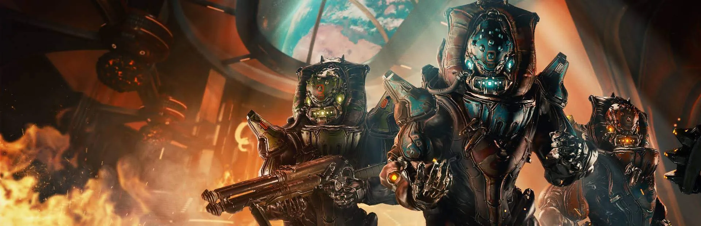

# Pyrus Projesi

**Pyrus Projesi** etkinliği süresince Dünya gezegenindeki yıkılmış **Strata Relay**‘i yeniden inşaat etmek için Steel Meridian’a yardım edin.

Kayıp Relay’ı yeniden inşa etmek için aşağıdaki görevleri tamamlayın ve gerekli kaynakları **Strata Relay**‘a giderek bağışlayın. Gereken talimatlar Cressa Tal ile oyuna giriş yaptığınızda gelen kutunuza iletilecek.

## Görev içeriği 



#### 3 tane Grustrag Üçlüsü‘nü yen

* Dünya, Merkür ve Satürn gezegenlerinden herhangi bir göreve girerek **Grustrag Üçlüsü**‘nü yenin. 3 kere yaptıktan sonra Grustrag Üçlüsü’nü yen aşaması tamamlanacaktır.
* **Ceres\(Lex\)**, **Sedna\(Adaro\)**, **Satürn\(Cassini\)** görevlerden herhangi birine girerek, 1-5dk arasında Grustrag Üçlüsü saptanmasını bekleyin. Grustrag Üçlüsü saptandığında Cressa Ta’den bir mesaj alacaksınız. Mini haritada gözüken sarı ikonlu Grustrag Üçlüsü’nü öldürerek görevi tamamlayın.



#### 30 tane **Pyrus Özü** bağışla

* Dünya, Merkür, Satürn ve Ceres gezegenlerinde herhangi bir göreve girerek Essence taşıyıcısı saptandığında Cressa Ta’den bir mesaj alacaksınız. Haritada yerini gösteren özel bir simge ile belirecektir. Taşıyıcıyı öldürüp **Pyrus Özü** kazanıyorsunuz.



#### Günlük Simaris Sentez Görevini tamamla

Günlük Sentez Görevi Nereden Alınır?

* Navigasyon’dan herhangi bir Relaya gidin. \(Örn: Satürn-Relay\)
* Esc - Hızlı Gezinme - Cephalon Simaris
* Simaris’in yanına giderek **Herhangi bir hedef var mı?** seçilir
* Sentezlemesi gereken hedefi ve ödülleri size sunar, **Bu sentezi uygulayacağım** diyerek görevi alabilir veya **Bu görevi şu an alamam** diyerek daha sonra sentezlemek için Simaris’e uğrayabilirsiniz.



#### 5 tane Relay Sütun Malzemesi bağışla

* Cressa Tal ile gelen kutunuza iletilen **Relay Sütun Bileşeni** kalıbını atölyenizde inşa edin. Trembaba Cevheri bileşeni Dünya, Merkür, Ceres ve Satürn gezegenlerinden herhangi bir göreve girerek elde ediliyor.
* **Tavsiye Görev:** Satürn - \(Helene, Titan\)



Aşamaları tamamladıktan sonra **Strata Relay**‘a giderek inşaata katkıda bulunun. Yardımlarınız için aşağıdaki ödülleri alıyorsunuz.

* Zylok
* Tabanca Riven
* Ember Gemi Dekorasyonu

Katkıda bulunma yapıp **Strata Relay**ı terk ettiğinizde Cressa Tal uyarı yaparak Sargas Ruk ile birlikte orduları **Strata Relay**ı işgal ettiğine dair bir mesaj yolluyor. Sargas Ruk ile birlikte orduların yenerek **Strata Relay**ı kurtarıyorsunuz. 2.yardımınız için aşağıdaki ödülü alıyorsunuz.

* Liset Athari Derisi

