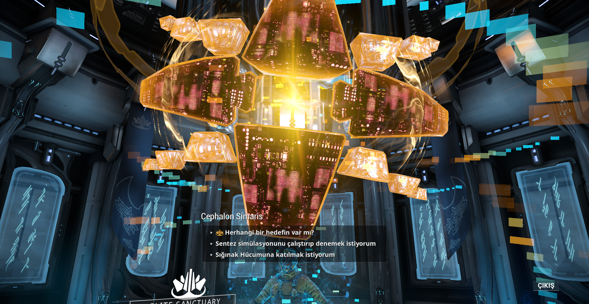

# Cephalon Simaris

Güneş Sistemi genelinde Tenno Relay’larının bünyesinde bulunan Cephalon yapısıdır. Cephalon Simaris’in gelişmiş sentez tarayıcısı kullanılarak Kodeks’e özgü hedefleri tarayarak yeni bilgiler ve Sendika ödülleri elde edilir.



#### Kinetic Siphon Trap

Sentez hedeflerini yavaşlatmak veya dikkatlerini çekmek için kullanılır.



#### Günlük Sentez Görevi Nereden Alınır? 

* Navigasyon’dan herhangi bir Relaya gidin. \(Örn: Satürn-Relay\)
* Esc - Hızlı Gezinme - Cephalon Simaris
* Simaris’in yanına giderek **Herhangi bir hedef var mı?** seçilir
* Sentezlemesi gereken hedefi ve ödülleri size sunar, **Bu sentezi uygulayacağım** diyerek görevi alabilir veya **Bu görevi şu an alamam** diyerek daha sonra sentezlemek için Simaris’e uğrayabilirsiniz.

> Sentez taramaları tamamladıktan sonra Cephalon Simaris’in yanına giderek ödülü alabilirsiniz.



