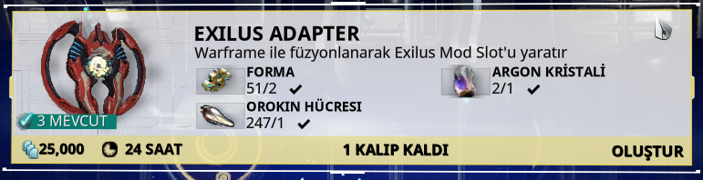

# Exilus Adapter

Exilus Adapter, Warframe ile füzyonlanarak Exilus Mod Slot'u oluşturur.

* Kalıp, Natah questi tamamlandıktan sonra Cephalon Simaris'ten elde edilebileceği gibi Teshin'den de satın alınabilir.

## Ne işe yarar?

Warframe'e ilaveten 1 slot daha açarak kullanılacak Exilus Mod ile Güç veya Menzili arttırılır.

## Nasıl kullanabilirim?

1. Kilitli Exilus mod slotu alanına tıklanır
2. Füzyonlama işlemi için onay penceresinden Tamam diyerek işlem gerçekleşir.

## Üretim Gereksinimleri

## Not

* Füzyonlama işlemi yapıldıktan sonra kullanılan **Exilus Adapter** geri alınamaz.
* Exilus Adapter yok ise **Cephalon Simaris** tekliflerden 50,000 mevki veya 20 Platinum karşılığında alıp, slotu açabilirsiniz.

