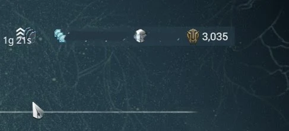

# Orokin Dukat

Orokin Dukat , Baro Ki'Teer tarafından satılan Efsanevi Modlar, özel silahlar, orbiter için süs eşyaları, Arttırıcı, Syandana gibi ürünleri satın almak için gerekli para birimidir.

Dukatların değeri 3'e ayrılır:

* Bronz - 15 Dukat
* Gümüş - 45 Dukat
* Altın - 100 Dukat 

> Dukat: Sadece Prime kalıp ve bileşenlerden elde edilir. Diğer oyuncular ile takas edilemez!

* Dukat Miktarı öğrenmek için **Esc-Ekipman-Envanter**

