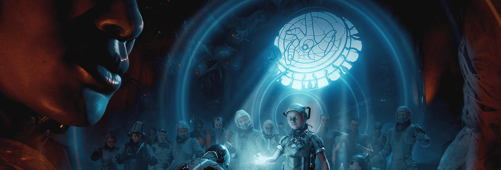

# Temsilci

## Outbreak 

Outbreak Görevleri Sezon 2 - Bölüm 5 ile aktif olan nightwave mevkisi kasabileceğiniz mini görevlerdir.

### Zealot Derelict Kodu 

Aktif olduğu gezegendeki istila görevini 3 kez tamamlanarak gelen kutusuna 1 adet Zealot Derelict Kodu kazanılır. Zealot Derelict Kodu kullanılarak tamamlanan görevler 1.5k nightwave puanı verir.

