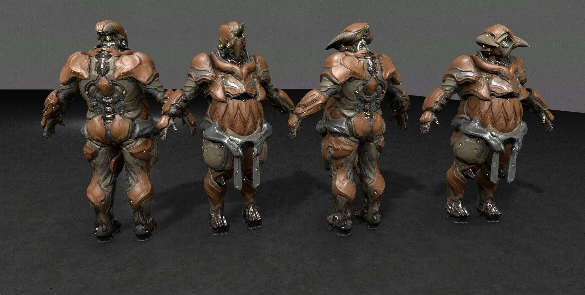
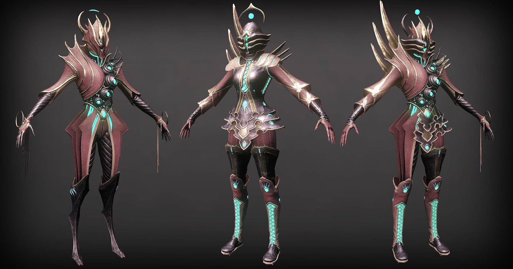
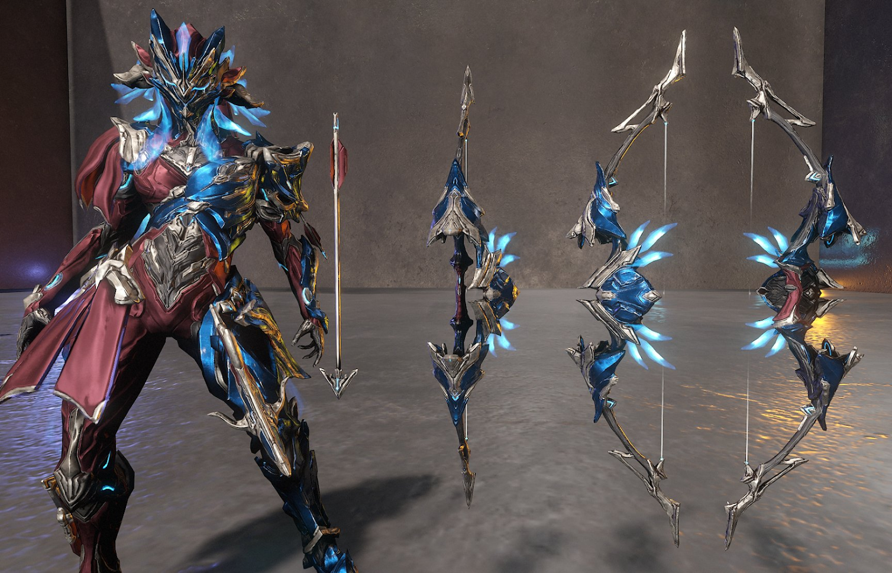
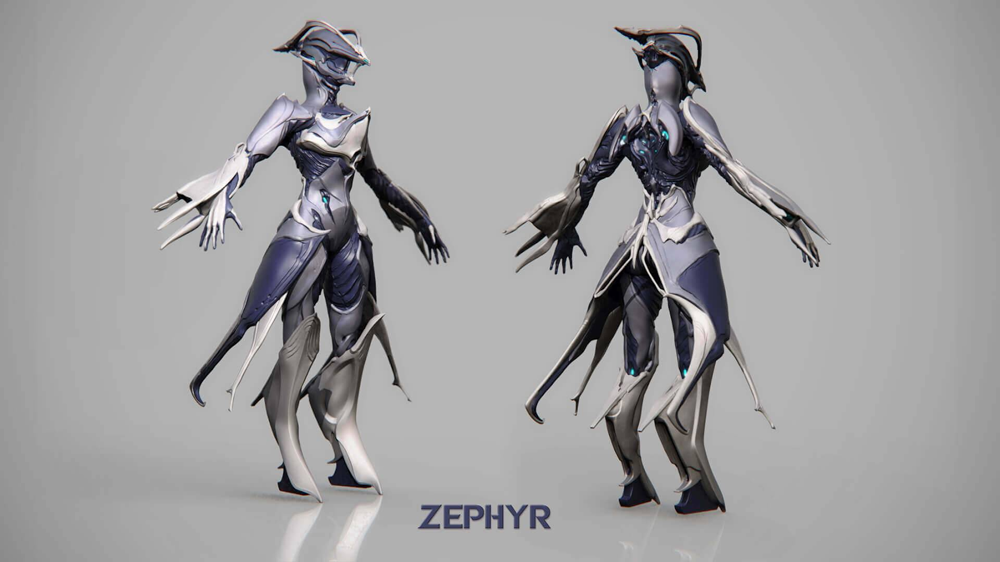

# Yenilikler

## 2019 / Ekim


**Update 26** / Anahat Güncellemesi


### **Grendel** 

Yeni warframe **Grendel**



Birincil ve ikincil silahlar için Exilus yuvası, yani yardımcı Modlarınızı donatmak için ekstra bir alana sahip olacaksınız. Melee 3.0 aktif olana kadar bu silahları alamayacak.



### Yapılandırmalar

Üç ek satın alınabilir yükseltme ve Görünüm yapılandırması, yani Warframe başına toplam 6'a kadar genişletebilirsiniz.

### Vauban & Ember Reworks

> [https://forums.warframe.com/topic/1132197-vauban-ember-dev-workshop/](https://forums.warframe.com/topic/1132197-vauban-ember-dev-workshop/)





### Titania Deluxe



### Halloween

Cadılar bayramı etkinlik yaklaşıyor. Etkinlik boyunca kazanılacak ödüllerin yanı sıra warframe görünümüne görsellik katabileceğiniz **yarasa ephemera** alınabilecek.

### Bat Ephemera



### **Vampire Kavat**

Eidolon Ovasında yeni bir vahşi yaşam türü olan vampir kavat yalnızca geceleri doğacak ve koruma eko sisteminin bir parçası olacak. Aynı zamanda kendi Vampir Kavat'ınızı da alabileceksiniz.



## 2019 / Sonbahar

### Empyrean

Sonbahar ayında gelmesi planlanıyor.

> Empyrean güncellemesi üç aşamada gerçekleştirilecek

#### Railjack Hakkında Bilgiler

* Klandan bağımsız kendinize ait geminiz olacak
* Hem iç hem dış renkler ayrı ayrı özelleştirilebilir olacak
* Çeşitli güçler ve yükseltmeler yer alacak, bazıları yeni kazanılacak kaynaklar ile araştırılacak
* Ekip harici Railjack'inizde size katılabilecek mürettebat üyelerini kullanabileceksiniz
* Warframe & Silah modlamasına aşina olduğunuz sistem yerine aktif olan modüller ile birlikte görev esnasında seviyeye göre etkinleştirilebilen ve devre dışı bırakılabilen güç ayarlamaları yapılabilecek
* Görev durumuna bağlı olarak modüller arasında güç ayarlaması, bunu yapmak içinde herhangi bir yerden sistem ekranına erişebilinecek.



## 2019 / Aralık

### The New War

\(24-25 Aralık\) - The New War questi noelde gelmesi planlanıyor.



## ∞ / Yakında

### Tile Sets

Yenilenen & Gelecek fayans işlemeleri









### Kuva Lich

Prosedürel bir düşmanın sizin için ortaya çıktığı ve bir Warframe'den ilişkili yetenek güclerinin yer alacağı bir sistemdir. Her Lich'in kendi doğuştan gelen bonusları ile kendine özgü silahları vardır. Nesillerinde, benzersiz oyun anlarıyla birlikte gelen tuhaf bir özellikle de gelebilirler.



Sol sistemdeki Kuva Lich etkisi. Takipçilerinin yıldız tablosunda işaretleneceği düğümler yer alıyor. Bu etkiyi azaltmak için bu takipçileri öldür.

### Sentinel

Sentinel temalı fayans işlemesi





### Duviri Paradoks

2019 TennoLive'da gösterilen bir sonraki Warframe açık dünyası



#### Dax Duviri

### MR 

Yeni Ustalık Rütbe Rozetleri

### Deluxe

Yeni deluxe derileri

### Echoes of Umbra


Spoiler!




